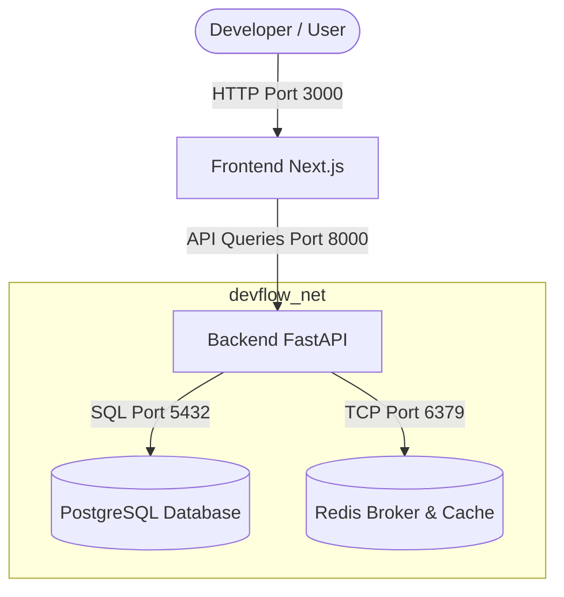

# DevFlow: Engineering Command Center

DevFlow is a premium Engineering Command Center and intelligence platform. It integrates with GitHub to monitor repository health, pull requests, issues, and developer metrics, and surfaces proactive AI-driven engineering insights from one unified, sleek command dashboard.

---

## 1. Service & Network Architecture

DevFlow is designed as a decoupled workspaces monorepo containing four core services operating in a local virtual bridge network:



### Infrastructure Port Registry

- **Frontend Client**: `http://localhost:3000`
- **Backend REST Gateway**: `http://localhost:8000`
- **Interactive Swagger Docs**: `http://localhost:8000/docs`
- **PostgreSQL Relational DB**: `localhost:5432`
- **Redis Cache / Task Broker**: `localhost:6379`

---

## 2. Onboarding & Local Development Setup

To initialize the project and get it running on your local machine, follow these steps:

### 2.1 Prerequisites

Ensure your local host has the following runtimes:

- **Node.js** (v20+ / npm 10+)
- **Python** (3.13+)
- **Docker & Docker Compose** (Recommended)

### 2.2 Standard Setup (Single Command)

Run the automated initialization command from the root folder:

```bash
make install
```

This script (`scripts/setup_dev.py`) will automatically:

1. Copy `.env.example` to create `.env` in the root and backend directories.
2. Install npm workspace modules and dependencies.
3. Configure the Python virtual environment (`apps/api/venv`).
4. Install all backend python packages, including code quality tools (pytest, black, ruff, mypy, pre-commit).
5. Install and configure Git pre-commit hooks locally.
6. Run the environment verification checklist (`scripts/verify_env.py`).

---

## 3. Orchestration & Local Run Commands

### 3.1 Docker Compose Development (Recommended)

You can build and start the complete containerized stack using the following Makefile targets:

- **Start the complete stack**:

  ```bash
  make start
  ```

- **Check container health**:

  ```bash
  docker compose ps
  ```

  Once booted, the internal healthcheck probes will execute:

  - **PostgreSQL**: verified using `pg_isready`.
  - **Redis**: verified using `redis-cli ping`.
  - **FastAPI Backend**: verified using a socket checker against `/api/v1/health`.
  - **Next.js Frontend**: verified using a node checker against path `/`.

- **Stop and wipe volumes**:

  ```bash
  make stop
  ```

- **Follow logs**:

  ```bash
  make logs
  ```

- **Database migrations**:
  ```bash
  make docker-migrate
  ```

---

### 3.2 Native Local Development

If you prefer running services directly on your host machine:

1. Start your local PostgreSQL (`5432`) and Redis (`6379`) instances (or run `docker compose up -d db redis`).
2. Run the Turborepo development runner:
   ```bash
   make dev
   ```
   This boots the Next.js dev server on `http://localhost:3000` and the FastAPI server on `http://localhost:8000` in concurrent hot-reload watch mode.
3. Run migrations on the native database:
   ```bash
   make migrate
   ```

---

## 4. Linting, Formatting, and Testing

DevFlow maintains high engineering standards. Run quality check routines regularly:

- **Formatting**: Format backend python files and frontend tsx/css files:
  ```bash
  make format
  ```
- **Linting & Typing**: Validate syntax rules, typing parameters, and ESLint configs:
  ```bash
  make lint
  ```
- **Testing**: Execute frontend and backend testing suites:
  ```bash
  make test
  ```
  _(Under the hood: runs Pytest for the FastAPI backend and Vitest for the Next.js frontend)_

---

## 5. Coding & Contribution Rules

Before writing code, please read our [Contribution Guidelines](CONTRIBUTING.md) to align on coding standards, commit messages, and PR processes. Release history can be tracked in the [Changelog](CHANGELOG.md).

---

## 6. Troubleshooting Guide

### ❌ Docker Daemon Connection Error

- **Issue**: `unable to get image ... failed to connect to the docker API`
- **Resolution**: Docker Desktop is not running. Please start Docker Desktop, ensure the daemon is active in your taskbar, and run `make start` again.

### ❌ Port Conflicts (e.g. 5432 or 6379 already in use)

- **Issue**: Docker Compose fails because a port is occupied.
- **Resolution**: A local database or Redis instance is already running natively. Stop the native service (e.g., `sudo systemctl stop postgresql` on Linux or via Services.msc on Windows) or update ports in `docker-compose.yml` / `.env`.

### ❌ Environment Validation Mismatch

- **Issue**: The setup script or `verify_env.py` fails reporting missing keys.
- **Resolution**: Compare your `.env` file against `.env.example`. Restore any missing key mappings. Run `python scripts/verify_env.py` to check again.
