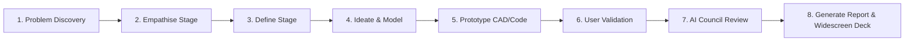
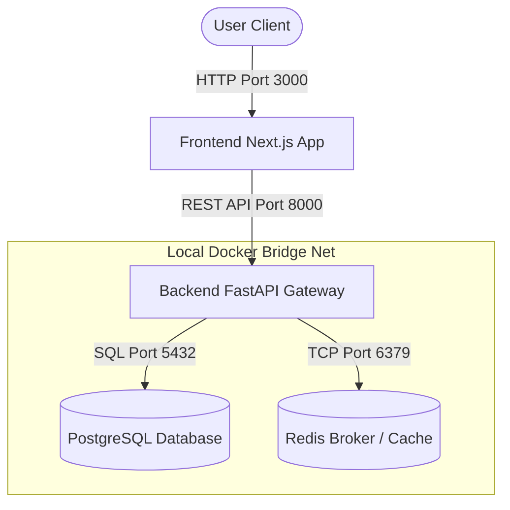

# DevFlow OS: Innovation Operating System

[](https://github.com/pravalika2307/DevFlow/actions)
[](LICENSE)
[](https://www.typescriptlang.org/)
[](https://nextjs.org/)
[](https://fastapi.tiangolo.com/)
[](https://www.docker.com/)
[](https://github.com/features/actions)
[](CHANGELOG.md)

DevFlow OS is a premium, multi-agent AI-powered Innovation Operating System designed to guide student teams, startups, and innovators from initial concept discovery to presentation-ready **Samsung Solve for Tomorrow** submissions.

Built on a Next.js 16 monorepo and styled with a sleek, dark Samsung-inspired glassmorphism design language, it bridges the gap between chaotic brainstorming and structured, compliance-ready project frameworks.

---

## 🧭 Innovation Journey Lifecycle

DevFlow OS models the double-diamond Design Thinking methodology combined with active AI validation gates.



---

## 🌌 Key Highlights

- **Innovation Workspace**: A premium flight deck hosting dynamic project progress indices, health rings, and a double-diamond design thinking wizard.
- **Problem Discovery Panel**: Tools for root cause analysis including the **5 Whys drill-down**, stakeholder maps, chronological research logs, and visual Fishbone skeletons.
- **AI Innovation Mentor (NOVA)**: Continuous contextual coaching that flags product blind spots, estimates feasibility, assesses risks, and maps SDG alignment.
- **Spatial Innovation Galaxy Map**: A beautiful 3D particle orbit representation where projects revolve around the AI Core. Orbit distance represents development stage, and connection lines trace shared SDG paths.
- **Impact Intelligence Matrix**: Formulates target SDG weights, outputs predictive beneficiary growth curves, and highlights inclusivity hazards.
- **NOVA Expert Council**: A simulated panel of 8 specialized AI agents (Tech Lead, SDG Ethicist, Accessibility Expert, and others) performing automated evaluations to deliver a unified Readiness Score.
- **One-Click Slide Deck & Reports**: Instantly render high-contrast pitch decks and compile print-ready PDF reports containing empathy maps, SDG matrices, and AI council reviews.

---

## 🏗️ Architecture & Network Setup

DevFlow is organized as a decoupled monorepo leveraging npm workspaces and Turborepo:



### Port Registry

- **Frontend Client**: `http://localhost:3000`
- **Backend API Gateway**: `http://localhost:8000`
- **Interactive Swagger Docs**: `http://localhost:8000/docs`
- **PostgreSQL Database**: `localhost:5432`
- **Redis Cache & Broker**: `localhost:6379`

---

## 🛠️ Onboarding & Quick Start

### Prerequisites

Make sure your local host has the following runtimes installed:

- **Node.js** (v20+ / npm 10+)
- **Python** (v3.13+)
- **Docker & Docker Compose** (Recommended for full services)

### Standard Setup (Single Command)

Run the automated installer script from the root folder:

```bash
make install
```

_Under the hood, this script (`scripts/setup_dev.py`) automatically generates environment config files, configures python virtual environments, installs npm packages, and sets up Git pre-commit format hooks._

---

## 🚀 Running Locally

### 1. Docker Compose (Recommended)

Compile and launch the containerized stack:

```bash
# Start the services
make start

# Verify container health checks (pg_isready, api health endpoints)
docker compose ps
```

To shut down and wipe volumes:

```bash
make stop
```

### 2. Native Dev Environment

If you prefer running services natively:

1. Start your local PostgreSQL and Redis servers.
2. Run the concurrent developer pipeline:

```bash
make dev
```

This runs the Next.js client on port `3000` and the FastAPI backend on port `8000` with hot-reload watch processes enabled.

---

## 🧪 Testing & Code Quality

Maintain codebase stability by running verification routines:

- **Format Code**: `make format` (runs Prettier for tsx/css, Black/Ruff for python)
- **Static Linting**: `make lint` (runs ESLint and Mypy static check compilers)
- **Unit Tests**: `make test` (runs Vitest for client, Pytest for backend)

---

## 📁 Repository Structure

```
├── apps
│   ├── api          # FastAPI Python backend service
│   │   ├── app      # Core logic (endpoints, middleware, schemas, models)
│   │   └── tests    # Backend testing suite
│   └── web          # Next.js App Router frontend application
│       ├── src      # Frontend assets, hooks, styling, and components
│       └── public   # Static images and client data assets
├── packages         # Shared configurations
│   ├── config       # Shared ESLint, Prettier, and Typescript configs
│   ├── types        # Global typings and models
│   └── ui           # Shared layout frameworks
├── docs             # Production blueprints, architecture, and diagrams
├── scripts          # Automated verification and installation utilities
├── Makefile         # Command shortcut orchestration
└── turbo.json       # Monorepo task cache configurations
```

---

## 📖 Extended Documentation

Refer to our deep-dive architecture folders:

- [System Architecture Guide](docs/ARCHITECTURE.md)
- [Front & Backend Design Specifications](docs/SYSTEM_DESIGN.md)
- [REST Endpoint Catalog](docs/API_REFERENCE.md)
- [Git Rules & Contributing Guidelines](docs/CONTRIBUTING.md)
- [Production Deployment Protocols](docs/DEPLOYMENT.md)
- [Security & Trusted Host Configurations](docs/SECURITY.md)
- [Product Milestone Changelog](docs/CHANGELOG.md)
- [Project Future Roadmap](docs/ROADMAP.md)

---

## 🤝 Contributing

Contributions are welcome! Please review [CONTRIBUTING.md](CONTRIBUTING.md) for details on code style requirements, branch patterns, and pull request validations.

---

## 🛡️ License

This project is licensed under the MIT License - see the [LICENSE](LICENSE) file for details.

---

## ✉️ Contact & Support

For Samsung Solve for Tomorrow queries, demo day schedules, or general support, please reach out to the project maintainers at `support@devflow.io`.
