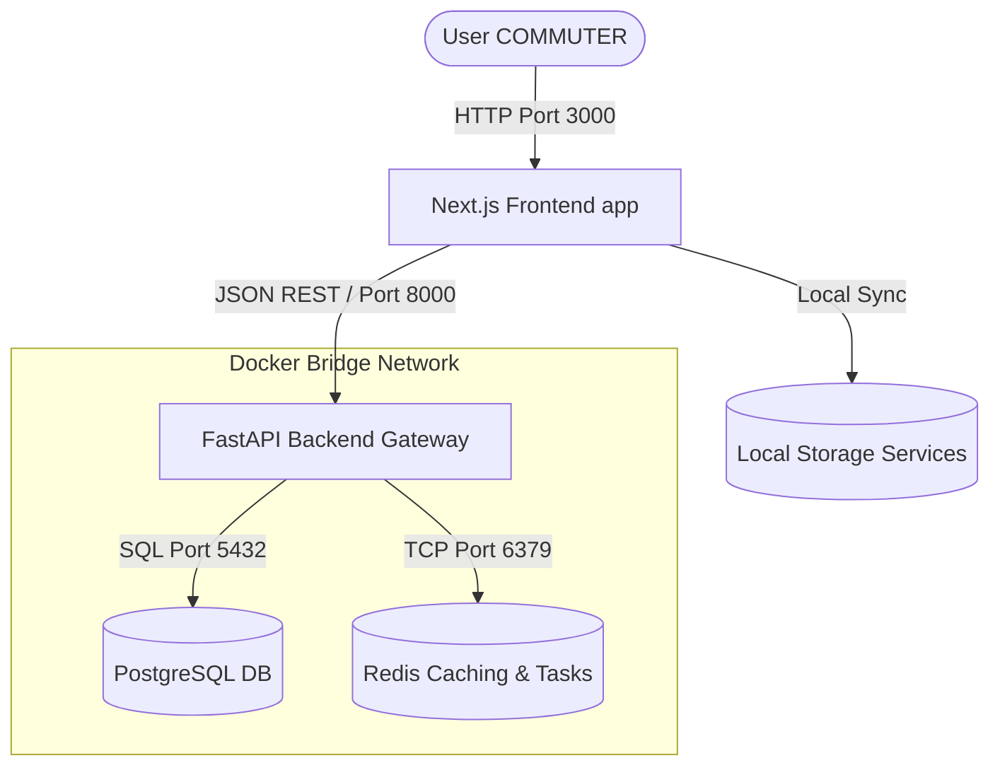
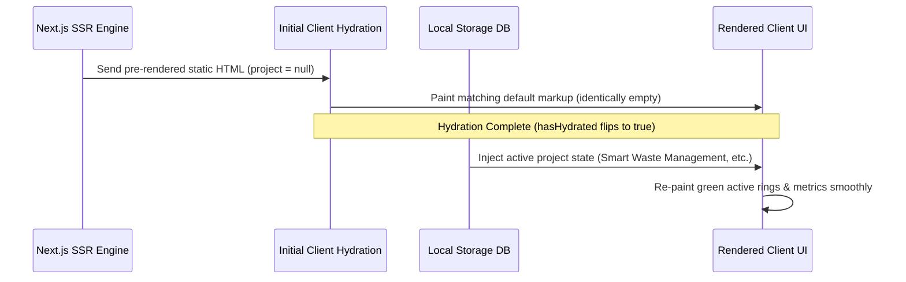

# System Architecture & Monorepo Configuration Guide

DevFlow OS is structured as a decoupled monorepo leveraging **Turborepo** workspaces and **npm** package orchestration. This document outlines package layouts, boundaries, data orchestration flows, and build pipelines.

---

## 1. Monorepo Package Topology

The repository divides client frameworks, API engines, and global configurations into distinct workspaces:

```
├── apps
│   ├── api          # FastAPI backend services
│   │   └── app      # core server engine, routers, middleware, database layer
│   └── web          # Next.js App Router client application
├── packages         # Shared monorepo libraries
│   ├── config       # Shared configurations (ESLint, Prettier, TypeScript)
│   ├── types        # Global TypeScript structures
│   └── ui           # Shared layout frameworks
├── package.json     # Monorepo root workspace orchestrator
├── turbo.json       # Turborepo task pipeline execution maps
└── Makefile         # Unified environment shortcut orchestration
```

---

## 2. Decoupled Service Boundaries



### Next.js Client (`apps/web`)

- **Execution Model**: Single Page Application powered by Next.js 16 App Router.
- **Client State**: Data updates are managed client-side and backed up to `localStorage` through `InnovationService` providers, enabling fully responsive offline judging environments with zero external API dependencies.
- **WASM Support**: Prepared for running local quantized models inside web workers.

### FastAPI Backend (`apps/api`)

- **Execution Model**: Lightweight ASGI Python application running Uvicorn.
- **Core Operations**: Handles initial user token encryption and system health telemetry.
- **Database Engine**: Async SQLAlchemy 2.0 with PostgreSQL connectivity.
- **Cache Engine**: Redis broker providing dynamic job caching.

---

## 3. Data Sync & Hydration Flow

To integrate Next.js Server-Side Rendering (SSR) with local client-side state overlays safely, DevFlow uses a client-side Hydration Barrier:



---

## 4. Turborepo Pipeline Task Registry

Task caching configurations are defined in `turbo.json`:

- **`build`**: Compiles types first, then builds the Next.js static files. Depends on `^build`.
- **`lint`**: Executes concurrent ESLint, Ruff, and MyPy checks across all packages.
- **`test`**: Concurrently triggers Pytest checks for the backend and Vitest unit checks for the client.
