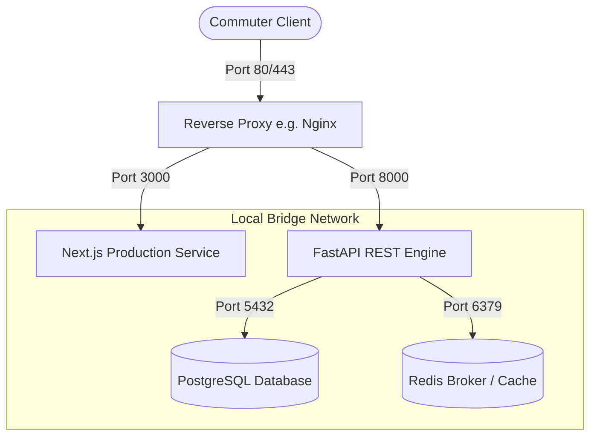

# Production Deployment Protocols

This document details production deployment targets, Docker Compose networks, port configurations, and runtime settings for DevFlow OS.

---

## 1. Virtual Container Topology



---

## 2. Infrastructure Registry & Ports

| Service                  | Dev URL                 | Production Port | Protocol | Docker Hostname |
| ------------------------ | ----------------------- | --------------- | -------- | --------------- |
| **Frontend Web**         | `http://localhost:3000` | `3000`          | HTTP     | `web`           |
| **Backend REST Gateway** | `http://localhost:8000` | `8000`          | HTTP     | `api`           |
| **PostgreSQL Database**  | `localhost:5432`        | `5432`          | TCP      | `db`            |
| **Redis Broker**         | `localhost:6379`        | `6379`          | TCP      | `redis`         |

---

## 3. Environment Variables & Configurations

Create `.env` using `.env.example`. Make sure the following keys are populated:

### Global Parameters

- `NODE_ENV`: Set to `production` for minimized compilation weights.
- `PROJECT_NAME`: Set to `"DevFlow OS"`.

### Backend API Parameters (`apps/api`)

- `POSTGRES_DB_URI`: Connection string for PostgreSQL (e.g. `postgresql+asyncpg://postgres:pass@db:5432/devflow`).
- `REDIS_URI`: Connection address for Redis caching (`redis://redis:6379/0`).
- `FERNET_KEY`: Secure symmetric key for credentials encryption. Generate using cryptography module.
- `BACKEND_CORS_ORIGINS`: Allowed client origins, formatted as JSON arrays (e.g. `["http://localhost:3000"]`).

---

## 4. Compile & Build Sequences

### Frontend Production Build

To prepare a Next.js optimized production build:

```bash
cd apps/web
npm run build
```

This performs static page optimizations and compiles static assets to the `.next` directory.

### Production Docker Boot

Build and start the complete containerized stack in daemon mode:

```bash
docker compose -f docker-compose.yml up --build -d
```

All containers launch health check sequences, monitoring process status via socket tests and connection hooks (such as `pg_isready`).
